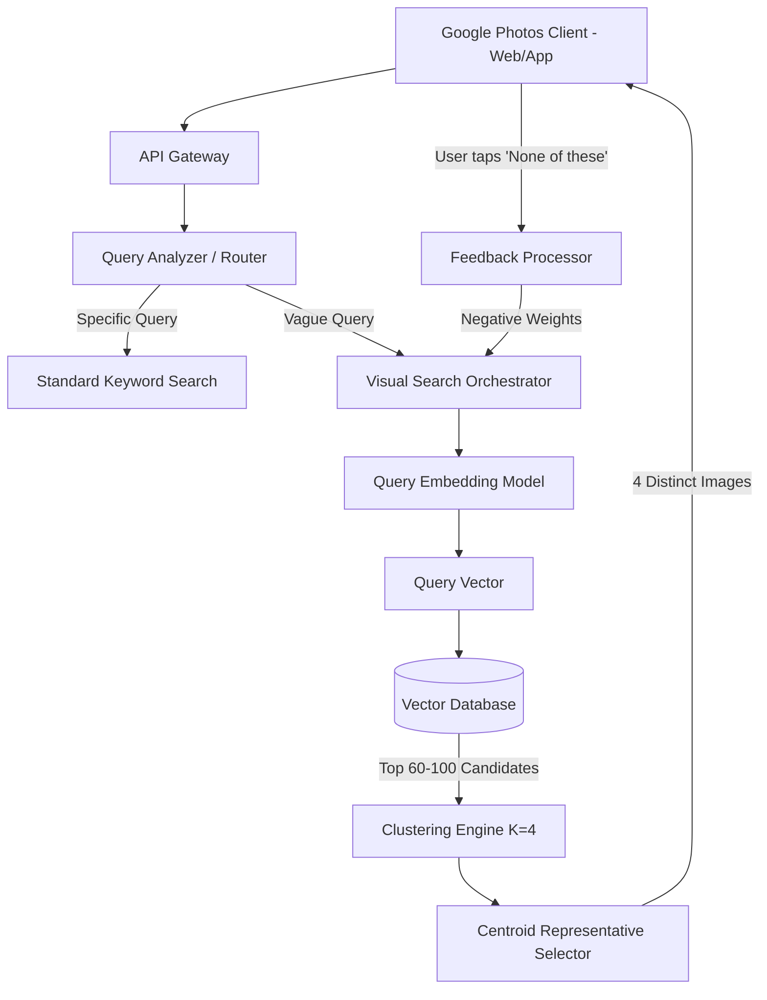
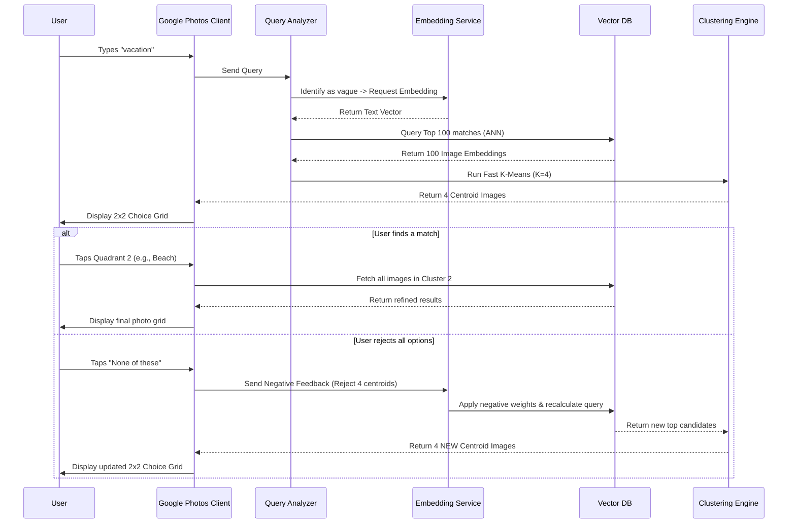

# Architecture Document: AI-Powered Discovery Engine & 2x2 Visual Choice Grid

## 1. System Overview
This architecture addresses the fundamental misalignment between human memory and computational retrieval in Google Photos. When users search using vague memories (e.g., sensory narratives, context, vibes) rather than rigid keywords, the system replaces linear search scrolling with a **2x2 Visual Choice Grid**. 

By utilizing multimodal embeddings, real-time clustering, and an intuitive "Hot or Cold" feedback loop, the system instantly disambiguates user intent without conversational overhead, thereby eliminating the "manual scroll tax" and reducing search abandonment.

---

## 2. High-Level Architecture

---

## 3. Core Components Detailed

### 3.1 Client Layer (Frontend)
*   **Search Bar Interface:** Accepts the user's initial text query while maintaining seamless UI continuity with Google Material Design.
*   **2x2 Visual Choice Grid Component:** A native component rendered organically beneath the search bar only when query ambiguity is detected. It displays 4 distinct visual directions.
*   **Interaction Handlers:** 
    *   *Positive Reinforcement:* Captures a user's tap on a specific quadrant to zero in on that cluster.
    *   *Negative Reinforcement:* Captures taps on the *"None of these (Show others)"* button to trigger a dynamic pivot.

### 3.2 Routing & Orchestration Layer
*   **Query Analyzer / Intent Router:** Evaluates if a query is precise (e.g., "IMG_4921.JPG" or a specific date) or vague (e.g., "vacation", "cozy dinner"). It routes precise queries to legacy search and vague queries to the Visual Search Orchestrator.
*   **Visual Search Orchestrator:** Manages session state, maintaining the context of previous feedback loops so the system knows what the user has already rejected.

### 3.3 Multimodal AI & Core Retrieval Engine
*   **Multimodal Embedding Model:** Converts the user's vague text query into a dense mathematical vector within a shared multimodal vector space.
*   **Vector Database (e.g., Google ScaNN):** A highly scalable, partitioned database storing pre-computed contextual embeddings for every photo in a user's library.
*   **Candidate Pool Retrieval Service:** Performs a rapid Approximate Nearest Neighbor (ANN) search to pull a pool of 60 to 100 candidate images that contextually match the text query vector.

### 3.4 Clustering & Refinement Engine
*   **On-the-Fly Vector Clustering ($K=4$):** Instead of showing the top 4 identical-looking nearest neighbors, this service runs a fast clustering algorithm (like K-Means) across the 60-100 candidates to segment them into 4 distinct visual/contextual themes.
*   **Centroid Representative Selection:** Selects the single photo closest to the mathematical center (centroid) of each cluster, maximizing the visual contrast between the four quadrants of the grid.
*   **Dynamic Pivot / Feedback Processor:** When a user taps "None of these", this processor applies a negative vector weight to the 4 rejected cluster centroids, mathematically pushing the query vector away from those concepts. It then requests a recalculated candidate pool.

### 3.5 Offline Background Data Pipeline
*   **Photo Ingestion Service:** Asynchronously processes newly uploaded media.
*   **Embedding Generator:** Analyzes pixels, objects, vibes, and EXIF data (location, time) to generate high-dimensional vectors.
*   **Vector Indexer:** Continuously updates the Vector Database per user partition.

---

## 4. Sequence Diagram: The Discovery & Refinement Loop

---

## 5. Non-Functional Requirements (NFRs)

*   **Ultra-Low Latency:** Because human visual scene processing occurs in under 100 milliseconds, the total round-trip time (query ingestion -> ANN search -> clustering -> rendering) must be optimized to 200-300ms to maintain the illusion of instant, intuitive discovery.
*   **Multi-Tenant Privacy:** The Vector DB architecture must strictly partition data by User ID. Contextual embeddings and queries must never cross-pollinate between accounts.
*   **Compute Efficiency:** On-the-fly K=4 clustering over a small N (60-100) must be highly optimized (using lightweight C++ microservices or edge-compute architectures) to prevent CPU bottlenecks at Google-scale query volumes.

---

## 6. Analytics & Success Metrics Integration
To prove this architecture solves the business problem outlined in the KPI Tree, telemetry must capture:
*   **Search Abandonment Rate:** Track drops in abandonment after initial vague queries.
*   **Time to Disambiguation:** Measure the time from initial query to the final, successful photo click.
*   **Frustration / Scroll Tax:** Measure the reduction in manual scroll depth (pixels scrolled) compared to the legacy system.
*   **Pivot Depth:** Average number of "None of these" clicks required to achieve a successful retrieval.
